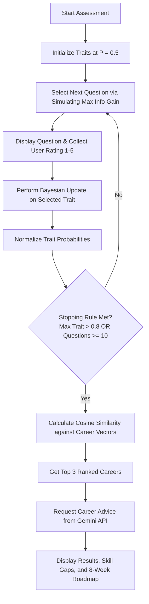

# AI Career Navigator

An adaptive career recommendation system that uses Bayesian probability theory, information theory, and generative AI to assess personal traits and guide users toward the most compatible professional paths.

The application is built with a decoupled architecture, combining a high-performance **FastAPI backend** (Python) and a modern **Next.js frontend** (React/TypeScript/Tailwind CSS).

---

## Table of Contents
1. [Core Features](#core-features)
2. [How It Works (Algorithmic Concepts)](#how-it-works-algorithmic-concepts)
   - [1. Personality Traits Model](#1-personality-traits-model)
   - [2. Bayesian Trait Inference](#2-bayesian-trait-inference)
   - [3. Adaptive Question Selection (Information Gain)](#3-adaptive-question-selection-information-gain)
   - [4. Career Vector Matching (Cosine Similarity)](#4-career-vector-matching-cosine-similarity)
   - [5. Gemini AI Career Advisor & Fallback Engine](#5-gemini-ai-career-advisor--fallback-engine)
3. [Architecture Overview](#architecture-overview)
   - [Backend Service (Python & FastAPI)](#backend-service-python--fastapi)
   - [Frontend Client (Next.js & TypeScript)](#frontend-client-nextjs--typescript)
4. [API Contract Reference](#api-contract-reference)
5. [Getting Started & Local Development](#getting-started--local-development)
   - [Prerequisites](#prerequisites)
   - [Backend Installation](#backend-installation)
   - [Frontend Installation](#frontend-installation)
   - [Running the App](#running-the-app)

---

## Core Features

- **Adaptive Questioning**: Instead of forcing users to answer a fixed set of dozens of questions, the system evaluates the state of the user's traits dynamically and chooses the next question that will resolve the most uncertainty.
- **Early Stopping**: The assessment is designed to stop as soon as it reaches high confidence (any trait probability > 0.8) or when it reaches the limit of 10 questions.
- **Vector-Based Match Ranking**: Ranks career alignment utilizing Cosine Similarity between the user's inferred traits and normalized career profiles.
- **AI-Powered Development Roadmap**: Interfaces with Google Gemini (`gemini-2.5-flash`) to generate structured advice, identify skill gaps, and detail an 8-week career roadmap.
- **Deterministic Fallback Engine**: If Gemini is offline or no API key is provided, a robust rule-based advisor takes over to ensure uninterrupted service.
- **Resilient UI State**: The Next.js frontend persists progress in LocalStorage, preventing data loss on accidental browser refreshes.

---

## How It Works (Algorithmic Concepts)

The AI Career Navigator employs a combination of probabilistic reasoning, information-theory simulations, and vector geometry to deliver its recommendations.



### 1. Personality Traits Model
The system measures user affinity across five fundamental traits:
- **Analytical**: Logical problem solving and data-driven decision-making.
- **Creativity**: Ideation, visual/structural design, and aversion to repetition.
- **Social**: Collaboration, communication, teamwork, and persuasion.
- **Risk**: Decision-making under uncertainty and comfort with experimentation.
- **Discipline**: Long-term consistency, organization, routines, and grit.

### 2. Bayesian Trait Inference
At the start of a session, the user's trait probability distribution is initialized uniformly:
$$P(\text{Analytical}) = P(\text{Creativity}) = P(\text{Social}) = P(\text{Risk}) = P(\text{Discipline}) = 0.5$$

When a user responds to a question on a 1-5 scale (where 1 is "Strongly Disagree" and 5 is "Strongly Agree"), a Bayesian update is applied to that question's associated trait. The question definition contains a Likelihood Map $P(\text{Answer} | \text{Trait})$ representing the conditional probability of selecting that answer given the user possesses that trait:

$$\text{Updated } P(\text{Trait}) = P(\text{Trait}) \times P(\text{Answer} | \text{Trait})$$

After updating, all trait values are renormalized to sum to $1.0$:

$$P(\text{Trait}_i) = \frac{P(\text{Trait}_i)}{\sum_{j=1}^{5} P(\text{Trait}_j)}$$

### 3. Adaptive Question Selection (Information Gain)
Rather than asking questions in a fixed sequence, the system dynamically simulates the utility of each remaining question in the bank:
1. For every unasked question, the system simulates all 5 possible responses ($1, 2, 3, 4, 5$).
2. For each hypothetical response, it calculates the updated trait state and measures its **Uncertainty Spread**:
   $$\text{Uncertainty}(S) = \max(S) - \min(S)$$
3. The average uncertainty across all 5 simulated responses is computed for each question.
4. The system selects the question with the **highest average simulated uncertainty** (which acts as a proxy for information gain, pulling the strongest and weakest traits further apart).

### 4. Career Vector Matching (Cosine Similarity)
Once the assessment finishes (either because a trait's probability exceeds $0.8$ or the limit of 10 questions is reached), the final normalized trait probabilities form a 5D vector representing the user's profile:
$$\vec{U} = [u_{\text{analytical}}, u_{\text{creativity}}, u_{\text{social}}, u_{\text{risk}}, u_{\text{discipline}}]$$

Each of the 10 careers in the database is represented by a benchmark profile vector $\vec{C}$, defined on a scale of $1$ to $10$. These vectors are normalized by dividing by $10.0$ to match the scale of the user vector:
$$\vec{C}_{\text{norm}} = \frac{\vec{C}}{10.0}$$

The alignment score is calculated using **Cosine Similarity**, measuring the cosine of the angle between the two vectors:
$$\text{Score}(\vec{U}, \vec{C}_{\text{norm}}) = \frac{\vec{U} \cdot \vec{C}_{\text{norm}}}{\|\vec{U}\| \|\vec{C}_{\text{norm}}\|}$$

The careers are ranked, and the top 3 matches are returned to the user.

### 5. Gemini AI Career Advisor & Fallback Engine
To convert numerical vectors into actionable career advice, the backend sends a structured prompt to the Gemini API (`gemini-2.5-flash`) requesting:
1. **Explanation**: Personalized explanation of why the user's top traits fit the recommended role.
2. **Skill Gap**: A checklist of weakest traits and strategies to prevent them from hindering success.
3. **Roadmap**: An actionable, step-by-step career development roadmap.

**Deterministic Fallback**: If the Gemini API is inaccessible or `GEMINI_API_KEY` is not provided, the application triggers a local rule-based engine (`advisor.py`) that uses Python logic to extract the user's strongest and weakest traits, generating a structured, fully compliant static career advice payload.

---

## Architecture Overview

### Backend Service (Python & FastAPI)
The backend is a lightweight FastAPI web server. Its modules include:
- `main.py`: Entry point, CORS configuration, session management with TTL cleanups, and HTTP endpoint handlers.
- `data.py`: The question bank (20 items with Likert scale conditional probabilities) and career database (10 profiles with 5D trait vectors). Includes runtime data validation.
- `models.py`: Pydantic models enforcing schema validations on requests and responses.
- `bayesian.py`: Implements Bayesian multiplication and state vector normalization.
- `selector.py`: Implements simulation-based information gain and stopping rules.
- `matcher.py`: Converts states and careers to NumPy arrays, calculating Cosine Similarity.
- `advisor.py`: Interfaces with the Gemini API (HTTP POST to Google Generative Language endpoints) and houses the fallback advice logic.

### Frontend Client (Next.js & TypeScript)
The frontend is a Next.js single-page application structure built with:
- `context/AssessmentContext.tsx`: The primary state coordinator storing session details, active question, and answers. Writes state updates to `localStorage` for refresh resilience.
- `lib/api.ts` & `lib/types.ts`: An API communication layer wrapped with response parsing and custom network error handling (`ApiError`).
- `app/layout.tsx` & `app/page.tsx`: Core shell and responsive landing page.
- `app/assessment/page.tsx`: Question layout showing progress, handling Likert inputs, and displaying loading spinner feedback.
- `app/result/page.tsx`: Displays best matches, alternatives, explanation cards, skill gap highlights, and the interactive development timeline.

---

## API Contract Reference

### 1. Start Session
- **Endpoint**: `POST /start`
- **Response Shape**:
  ```json
  {
    "session_id": "uuid-string",
    "question": {
      "id": "Q1",
      "text": "I enjoy solving complex logical problems"
    },
    "message": "Session started. Please answer using a value from 1 to 5."
  }
  ```

### 2. Submit Answer
- **Endpoint**: `POST /next`
- **Request Body**:
  ```json
  {
    "session_id": "uuid-string",
    "answer": 4
  }
  ```
- **Response Shape (Mid-Assessment)**:
  ```json
  {
    "session_id": "uuid-string",
    "question": {
      "id": "Q5",
      "text": "I enjoy coming up with new ideas"
    },
    "result": null,
    "message": "Next question selected.",
    "state": {
      "analytical": 0.28,
      "creativity": 0.18,
      "social": 0.18,
      "risk": 0.18,
      "discipline": 0.18
    }
  }
  ```
- **Response Shape (On Completion)**:
  ```json
  {
    "session_id": "uuid-string",
    "question": null,
    "result": {
      "best_match": { "role": "Data Analyst", "score": 0.9412 },
      "alternatives": [
        { "role": "Financial Analyst", "score": 0.9231 },
        { "role": "Business Analyst", "score": 0.8845 }
      ],
      "confidence": 0.9412,
      "state": { "analytical": 0.82, ... }
    },
    "message": "Assessment complete.",
    "state": { ... }
  }
  ```

### 3. Get Career Advice
- **Endpoint**: `POST /advice`
- **Request Body**:
  ```json
  {
    "analytical": 0.45,
    "creativity": 0.15,
    "social": 0.15,
    "risk": 0.10,
    "discipline": 0.15,
    "career": "Data Analyst"
  }
  ```
- **Response Shape**:
  ```json
  {
    "explanation": "Your high analytical skills make you an excellent candidate for...",
    "skill_gap": ["Risk: your lower comfort with uncertainty might cause hesitation..."],
    "roadmap": ["Week 1-2: Core SQL and Python data structures...", "Week 3-4: Build basic visual dashboards..."]
  }
  ```

---

## Getting Started & Local Development

### Prerequisites
- Python 3.11+
- Node.js 18+
- npm or yarn

### Backend Installation
1. Navigate to the backend directory:
   ```bash
   cd backend
   ```
2. Create and activate a Python virtual environment:
   ```bash
   python3 -m venv .venv
   source .venv/bin/activate
   ```
3. Install the required dependencies:
   ```bash
   pip install -r requirements.txt
   ```
4. *(Optional)* Add your Gemini API credentials. Create a `.env` file inside the `backend` folder:
   ```env
   GEMINI_API_KEY=your_actual_gemini_api_key_here
   GEMINI_MODEL=gemini-2.5-flash
   ```

### Frontend Installation
1. Navigate to the frontend directory:
   ```bash
   cd ../frontend
   ```
2. Install the node packages:
   ```bash
   npm install
   ```
3. *(Optional)* If running in production mode, specify the backend address:
   Create a `.env.local` file inside the `frontend` folder:
   ```env
   NEXT_PUBLIC_API_BASE_URL=http://127.0.0.1:8000
   ```

### Running the App
To run the full stack locally, open two terminal windows:

#### Terminal 1: Backend Service
```bash
cd backend
source .venv/bin/activate
uvicorn main:app --host 127.0.0.1 --port 8000 --reload
```

#### Terminal 2: Frontend Service
```bash
cd frontend
npm run dev
```

Open your browser to `http://localhost:3000` to interact with the application.
